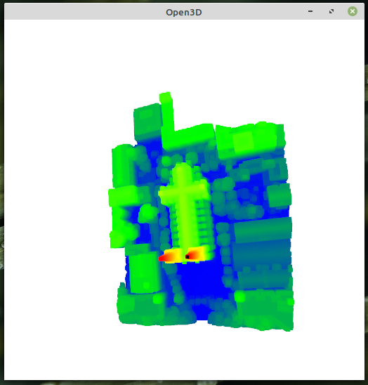
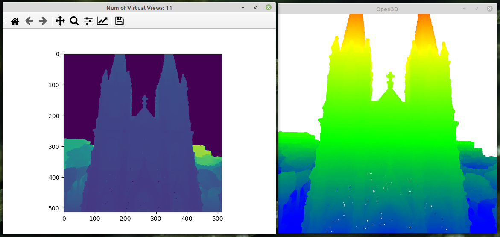

# Vis2Mesh

This is the offical repository of the paper:

**Vis2Mesh: Efficient Mesh Reconstruction from Unstructured Point Clouds of Large Scenes with Learned Virtual View Visibility**

[ICCV](https://openaccess.thecvf.com/content/ICCV2021/html/Song_Vis2Mesh_Efficient_Mesh_Reconstruction_From_Unstructured_Point_Clouds_of_Large_ICCV_2021_paper.html) | [Arxiv](https://arxiv.org/abs/2108.08378) | [Presentation](https://youtu.be/KN55e_q6llE?feature=shared)

```
@InProceedings{Song_2021_ICCV,
    author    = {Song, Shuang and Cui, Zhaopeng and Qin, Rongjun},
    title     = {Vis2Mesh: Efficient Mesh Reconstruction From Unstructured Point Clouds of Large Scenes With Learned Virtual View Visibility},
    booktitle = {Proceedings of the IEEE/CVF International Conference on Computer Vision (ICCV)},
    month     = {October},
    year      = {2021},
    pages     = {6514-6524}
}
```

##### Updates

- 2021/9/6: Intialize all in one project. Only this version only supports inferencing with our pre-trained weights. We will release Dockerfile to relief deploy efforts.

##### TODO

- Ground truth generation and network training.
- Evaluation scripts

#### Build With Docker (Recommended)

##### Install nvidia-docker2

```bash
# Add the package repositories
distribution=$(. /etc/os-release;echo $ID$VERSION_ID)
curl -s -L https://nvidia.github.io/nvidia-docker/gpgkey | sudo apt-key add -
curl -s -L https://nvidia.github.io/nvidia-docker/$distribution/nvidia-docker.list | sudo tee /etc/apt/sources.list.d/nvidia-docker.list

sudo apt-get update && sudo apt-get install -y nvidia-container-toolkit
sudo systemctl restart docker
```

##### Build docker image

`docker build . -t vis2mesh`

#### Build on Ubuntu

Please create a conda environment with pytorch and check out our setup script:

`./setup_tools.sh`
#### Usage
##### Get pretrained weights and examples

``` shell
pip install gdown
./checkpoints/get_pretrained.sh
./example/get_example.sh
```
##### Run example

The main command for surface reconstruction, the result will be copied as `$(CLOUDFILE)_vis2mesh.ply`.

`python inference.py example/example1.ply --cam cam0`

We suggested to use docker, either in interactive mode or single shot mode.

```bash
xhost +
name=vis2mesh
# Run in interactive mode
docker run -it \
--mount type=bind,source="$PWD/checkpoints",target=/workspace/checkpoints \
--mount type=bind,source="$PWD/example",target=/workspace/example \
--privileged \
--net=host \
-e NVIDIA_DRIVER_CAPABILITIES=all \
-e DISPLAY=unix$DISPLAY \
-v $XAUTH:/root/.Xauthority \
-v /tmp/.X11-unix:/tmp/.X11-unix:rw \
--device=/dev/dri \
--gpus all $name

cd /workspace
python inference.py example/example1.ply --cam cam0

# Run with single shot call
docker run \
--mount type=bind,source="$PWD/checkpoints",target=/workspace/checkpoints \
--mount type=bind,source="$PWD/example",target=/workspace/example \
--privileged \
--net=host \
-e NVIDIA_DRIVER_CAPABILITIES=all \
-e DISPLAY=unix$DISPLAY \
-v $XAUTH:/root/.Xauthority \
-v /tmp/.X11-unix:/tmp/.X11-unix:rw \
--device=/dev/dri \
--gpus all $name \
/workspace/inference.py example/example1.ply --cam cam0
```

##### Run with Customize Views

`python inference.py example/example1.ply`
Run the command without `--cam` flag, you can add virtual views interactively with the following GUI. Your views will be recorded in `example/example1.ply_WORK/cam*.json`.



Navigate in 3D viewer and click key `[Space]` to record current view. Click key `[Q]` to close the window and continue meshing process.




<!-- # Training

export DATASET_PATH="$PWD/dataset"
export PYTHONPATH="$PWD:$PYTHONPATH"

python trainer/train_visnet.py -d $DATASET_PATH -l 0.005 -b 15 -e 50 --decay-step 5 --decay-rate 0.5 -a 'PartialConvUNet(input_channels=2)'
python trainer/train_depthnet.py -d $DATASET_PATH -l 0.005 -b 15 -e 50 --decay-step 5 --decay-rate 0.5 -a 'PartialConvUNet(input_channels=2)'
python trainer/train_depthnetrefine.py -d $DATASET_PATH -l 0.001 -b 8 -e 30 --decay-step 5 --decay-rate 0.5 -a 'PartialConvUNet(input_channels=2)' 'PartialConvUNet(input_channels=2)' -t True True --load0 "checkpoints/VIS_PartialConvUNet(input_channels=2)_epoch50.pth" --load1 "checkpoints/DEPTH_PartialConvUNet(input_channels=2)_epoch50.pth"

mv "checkpoints/REFDEPTH_PartialConvUNet(input_channels=2)_epoch30.pth" "checkpoints/REFDEPTH_PartialConvUNet(input_channels=2)_epoch30_best.pth"

python trainer/train_cascadenet.py -d $DATASET_PATH -l 0.001 -b 5 -e 70 --decay-step 7 --decay-rate 0.5 -a 'PartialConvUNet(input_channels=2)' 'PartialConvUNet(input_channels=2)' 'PartialConvUNet(input_channels=3)' -t False False True --load0 "checkpoints/REFVIS_PartialConvUNet(input_channels=2)_epoch30_best.pth" --load1 "checkpoints/REFDEPTH_PartialConvUNet(input_channels=2)_epoch30_best.pth"

python trainer/train_cascadenet.py -d $DATASET_PATH -l 0.0001 -b 5 -e 30 --decay-step 8 --decay-rate 0.5 -a 'PartialConvUNet(input_channels=2)' 'PartialConvUNet(input_channels=2)' 'PartialConvUNet(input_channels=3)' -t True True True --load "checkpoints/VISDEPVIS_['PartialConvUNet(input_channels=2)', 'PartialConvUNet(input_channels=2)', 'PartialConvUNet(input_channels=3)']_epoch70.pth"

mv "checkpoints/VISDEPVIS_['PartialConvUNet(input_channels=2)', 'PartialConvUNet(input_channels=2)', 'PartialConvUNet(input_channels=3)']_epoch30.pth" "checkpoints/VISDEPVIS_CascadePPP_epoch30.pth" -->
